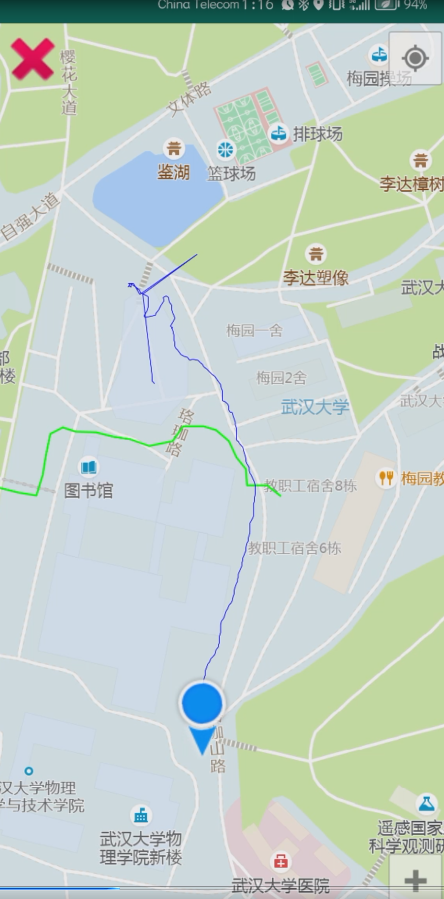
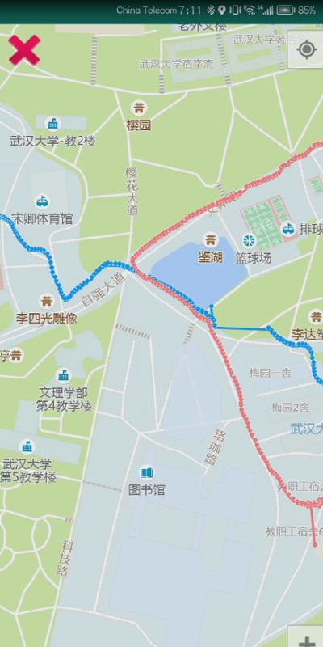

# TotemDB

武汉大学移动端Totem数据库系统 [https://github.com/whu-totemdb/tmdb]

## 介绍

本项目为武汉大学2020级计算机弘毅班"数据库系统实现"课程的大作业。

### Task 1

设计系统表，并实现系统表的读取和保存。

### Task 2

实现对象Join操作。

### Task 3

实现更新迁移、跨类查询； 实现手机端轨迹数据的join操作并进行可视化。

| JOIN前                                 | JOIN后                               |
| -------------------------------------- | ------------------------------------ |
|  |  |

## 参考资料

[TMDB总体设计文档](file/TMDB总体设计文档3.0.pdf)

[对象代理介绍](http://totemdb.whu.edu.cn/upload/202102/02/202102022020113648.pdf)

[Totem用户手册](http://totemdb.whu.edu.cn/upload/202102/02/202102022020276488.pdf)

